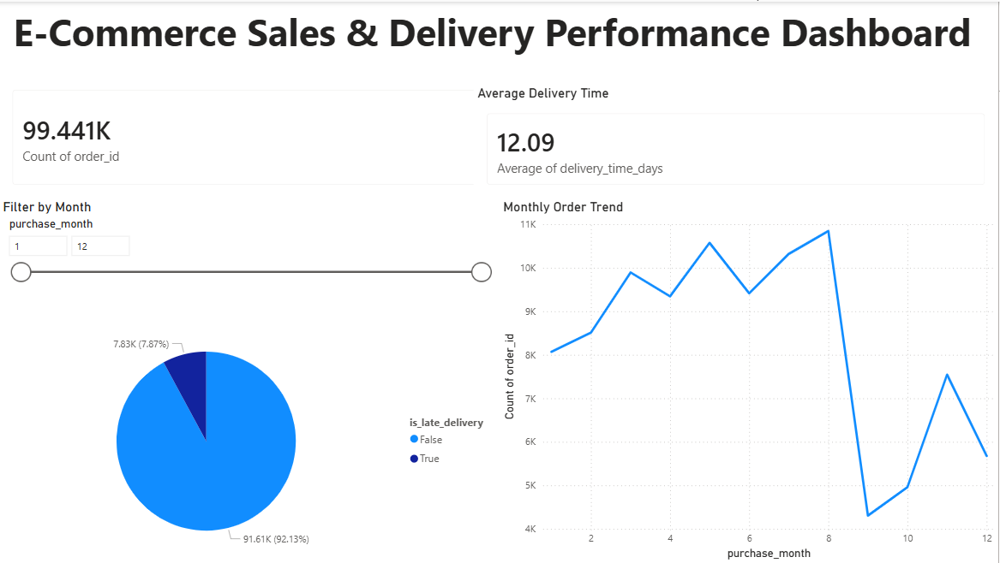

# ApexPlanet Data Analytics Internship Project

## Overview
This repository contains all tasks completed as part of the ApexPlanet Data Analytics Internship program. The project focuses on data cleaning, exploratory data analysis, business intelligence, dashboarding, and statistical validation using real-world e-commerce data.

---

# Project Structure

## datasets/
Contains raw datasets used for analysis.

## cleaned_data/
Contains cleaned and transformed datasets.

## notebooks/
Contains Jupyter notebooks for all tasks:
- Task 1: Data Cleaning & Wrangling
- Task 2: EDA & Business Intelligence
- Task 4: Statistical Validation & Storytelling

## dashboards/
Contains Power BI dashboard files.

## reports/
Contains summary reports for each task.

## sql/
Contains SQL business query files.

---

# Tools & Technologies Used

- Python
- Pandas
- Matplotlib
- Power BI
- SQL
- Git & GitHub
- Jupyter Notebook

---

# Key Business Insights

- Most orders were delivered successfully.
- Late deliveries represented a smaller percentage of total orders.
- Delivery performance varied across months.
- Statistical testing confirmed significant differences between late and on-time deliveries.
- Interactive dashboards provided operational and logistics insights.

---

# Dashboard Features

- Total Orders KPI
- Average Delivery Time KPI
- Monthly Order Trend Analysis
- Late Delivery Analysis
- Interactive Filters using Slicers

---

# Statistical Validation

A T-Test was performed to validate whether late deliveries had significantly higher delivery times compared to on-time deliveries.

---

# Outcome

This project demonstrates:
- End-to-end data analytics workflow
- Business intelligence reporting
- Dashboard development
- Statistical analysis
- Data storytelling
- GitHub project management

---
## Dashboard Preview

# Author

Likhitha